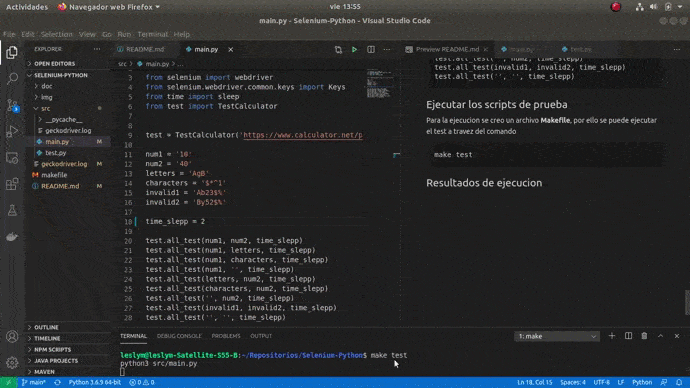

# Selenium-Python

## Tabla de Contenido

- [Configuracion de entorno](##Configuracion-de-entorno)

- [Disenho de casos de pruebas](##Disenho-de-casos-de-pruebas)

- [Implementacion scripts de prueba](##Implementacion-scripts-de-prueba)

    - [test.py](##test.py)

    - [main.py](##main.py)

    - [Ejecutar los scripts de prueba](##Ejecutar-los-scripts-de-prueba)

    - [Resultados de ejecucion](##Resultados-de-ejecucion)

- [Implementacion con unittest](##Implementacion-con-unittest)


    - [Ejecutar los scripts unittest](##Ejecutar-los-scripts-unittest)

    - [Resultados de ejecucion unittest](##Resultados-de-ejecucion)


## Configuracion de entorno

La biblioteca de [Selenium](https://pypi.org/project/selenium/) Python está disponible en el repositorio oficial de Python PyPI, se instalara a travez del comando  
``` 
pip3 install selenium 
```

El controlador Firefox [Gecko](https://github.com/mozilla/geckodriver/releases/tag/v0.28.0) le permite controlar o automatizar el navegador web Firefox usando Selenium. Ejecutandose los siguientes comandos.

```
wget https://github.com/mozilla/geckodriver/releases/download/v0.28.0/geckodriver-v0.28.0-linux64.tar.gz
tar xvfz geckodriver-v0.28.0-linux64.tar.gz
geckodriver
mv geckodriver ~/.local/bin
```


## Disenho de casos de pruebas

Se diseno casos de prueba para Percentage Calculator, Percentage Calculator in Common Phrases, Percentage Difference Calculator y Percentage Change Calculator en el siguiente
[excel](https://docs.google.com/spreadsheets/d/1vGCghKzJ5diF-tdF4vlKCQdwj7bJsukwmA518IvGXug/edit?usp=sharing)
se encuentra detallado lo siguiente:

- Test Case ID
- Test Scenario
- Test Steps
- Test Data
- Expected Results
- Actual Results
- Pass/Fail


## Implementacion scripts de prueba

Se creo 2 archivos **main.py** y **test.py** que se detallaran cada uno a continuacion.

### test.py

Se importo las librerias necesarias

```python
from selenium import webdriver
from selenium.webdriver.common.keys import Keys
from time import sleep
```

Tambien se creo la clase **TestCalculator**, que posee un contructor en el cual se vinculara el navegador y posteriormente el link de [Percentage Calculator](https://www.calculator.net/percent-calculator.html)

```python
class TestCalculator:
    def __init__(self, link):
        self.browser = webdriver.Firefox()
        self.browser.get(link)
```

Se creo una funcion para testear Percentage Calculator 


```python
    def PCalculator(self, num1, num2):
        var1 = self.browser.find_element_by_id('cpar1')
        var1.clear()
        var1.send_keys(num1)

        var2 = self.browser.find_element_by_id('cpar2')
        var2.clear()
        var2.send_keys(num2)

        submitButton = self.browser.find_elements_by_xpath("//input[@value='Calculate']")[0]
        submitButton.click()

```

Se creo tres funciones para testear cada uno de las secciones que posee Percentage Calculator in Common Phrases 

```python
    def PinCommon_1(self, num1, num2):
        var1 = self.browser.find_element_by_name('c21par1')
        var1.clear()
        var1.send_keys(num1)

        var2 = self.browser.find_element_by_name('c21par2')
        var2.clear()
        var2.send_keys(num2)

        submitButton = self.browser.find_elements_by_xpath("//input[@value='Calculate']")[1]
        submitButton.click()


    def PinCommon_2(self, num1, num2):
        var1 = self.browser.find_element_by_name('c22par1')
        var1.clear()
        var1.send_keys(num1)

        var2 = self.browser.find_element_by_name('c22par2')
        var2.clear()
        var2.send_keys(num2)

        submitButton = self.browser.find_elements_by_xpath("//input[@value='Calculate']")[2]
        submitButton.click()


    def PinCommon_3(self, num1, num2):
        var1 = self.browser.find_element_by_name('c23par1')
        var1.clear()
        var1.send_keys(num1)

        var2 = self.browser.find_element_by_name('c23par2')
        var2.clear()
        var2.send_keys(num2)

        submitButton = self.browser.find_elements_by_xpath("//input[@value='Calculate']")[3]
        submitButton.click()
```

Se creo una funcion para testear Difference Calculator


```python
    def PDiffCalculator(self, num1, num2):
        var1 = self.browser.find_element_by_name('c3par1')
        var1.clear()
        var1.send_keys(num1)

        var2 = self.browser.find_element_by_name('c3par2')
        var2.clear()
        var2.send_keys(num2)

        submitButton = self.browser.find_elements_by_xpath("//input[@value='Calculate']")[4]
        submitButton.click()
```

Se creo dos funciones para testear Percentage Change Calculator cuando sea Increase y Decrease.


```python
    def PChange_Decrease(self, num1, num2):
        var1 = self.browser.find_element_by_name('c2par1')
        var1.clear()
        var1.send_keys(num1)

        var2 = self.browser.find_element_by_name('c2par2')
        var2.clear()
        var2.send_keys(num2)

        self.browser.find_element_by_xpath("//select[@name='c2type']/option[text()='Decrease']").click()

        submitButton = self.browser.find_elements_by_xpath("//input[@value='Calculate']")[5]
        submitButton.click()


    def PChange_Increase(self, num1, num2):
        var1 = self.browser.find_element_by_name('c2par1')
        var1.clear()
        var1.send_keys(num1)

        var2 = self.browser.find_element_by_name('c2par2')
        var2.clear()
        var2.send_keys(num2)

        self.browser.find_element_by_xpath("//select[@name='c2type']/option[text()='Increase']").click()

        submitButton = self.browser.find_elements_by_xpath("//input[@value='Calculate']")[5]
        submitButton.click()
```


Por ultimo se implemento una funcion que testeara todas las funciones anteriormente implementadas tomando 2 valores como paramentro y un tiempo de espera entre cada uno.

```python
    def all_test(self, a, b, time_sleep):
        self.PCalculator(a, b)
        sleep(time_sleep)
        self.PinCommon_1(a, b)
        sleep(time_sleep)
        self.PinCommon_2(a, b)
        sleep(time_sleep)
        self.PinCommon_3(a, b)
        sleep(time_sleep)
        self.PDiffCalculator(a, b)
        sleep(time_sleep)
        self.PChange_Increase(a, b)
        sleep(time_sleep)
        self.PChange_Decrease(a, b)
        sleep(time_sleep)
```


### main.py


Se importo las librerias necesarias


```python
#!/usr/bin/env python

from selenium import webdriver
from selenium.webdriver.common.keys import Keys
from time import sleep
from test import TestCalculator
```

Se inicializo la clase TestCalculator tomando como paramentro la pagina de [Percentage Calculator](https://www.calculator.net/percent-calculator.html)


```python
test = TestCalculator('https://www.calculator.net/percent-calculator.html')
```

Se crearon las variables que se pondra como paramentros a testear y el tiempo de espera


```python
num1 = '10'
num2 = '40'
letters = 'AgB'
characters = '$*^1'
invalid1 = 'Ab23$%'
invalid2 = 'By52$%'

time_slepp = 5
```

Por ultimo se realizo los tests correspondientes a los disenados en los casos de Prueba del [excel](https://docs.google.com/spreadsheets/d/1vGCghKzJ5diF-tdF4vlKCQdwj7bJsukwmA518IvGXug/edit?usp=sharing)

```python
test.all_test(num1, num2, time_slepp)
test.all_test(num1, letters, time_slepp)
test.all_test(num1, characters, time_slepp)
test.all_test(num1, '', time_slepp)
test.all_test(letters, num2, time_slepp)
test.all_test(characters, num2, time_slepp)
test.all_test('', num2, time_slepp)
test.all_test(invalid1, invalid2, time_slepp)
test.all_test('', '', time_slepp)
```


## Ejecutar los scripts de prueba

Para la ejecucion se creo un archivo **Makefile**, por ello se puede ejecutar el test a travez del comando

```
make test
```


## Resultados de ejecucion

<p align="center">
  
</p>

<p align="center">
  
</p>


## Implementacion con unittest

Se creo un nuevo archivo **unittestCal.py** en el cual se utilizara Unittest de python.


Se importo las librerias necesarias


```python
import unittest
from selenium import webdriver
from selenium.webdriver.common.keys import Keys
from time import sleep
```

Tambien se creo la clase **InputFormsCheck**, en la cual se inicializa la pagina de [Percentage Calculator](https://www.calculator.net/percent-calculator.html)
en la cual se realizo 2 test uno al maximizar y otro a que no supere los 10 segundos.

```python
class InputFormsCheck(unittest.TestCase):

    def setUp(self):
        self.browser = webdriver.Firefox()
        self.browser.get('https://www.calculator.net/percent-calculator.html')
        self.browser.maximize_window()
        self.browser.implicitly_wait(10)
```

A las funciones anteriormente implementadas se le agrego la siguiente linea de codigo en la parte final, que verificara si existe o no un resultado

```python
self.assertTrue(self.browser.find_element_by_class_name('h2result'))
```

Para terminar se inicializa las pruebas
```python
if __name__ == "__main__":
    unittest.main()
```


## Ejecutar los scripts unittest

Para la ejecucion se creo un archivo **Makefile**, por ello se puede ejecutar el test a travez del comando

```
make unittest
```


## Resultados de ejecucion unittest

<p align="center">
  
</p>